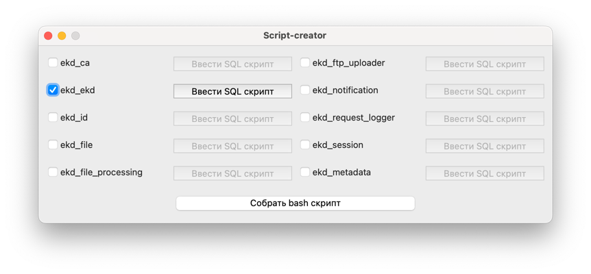
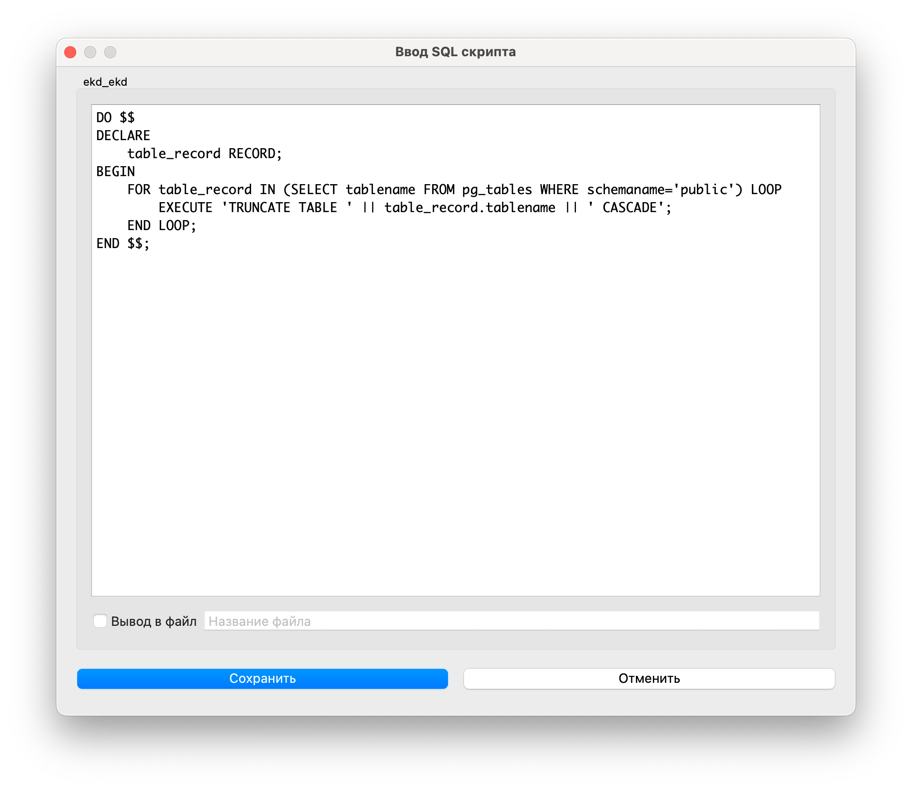
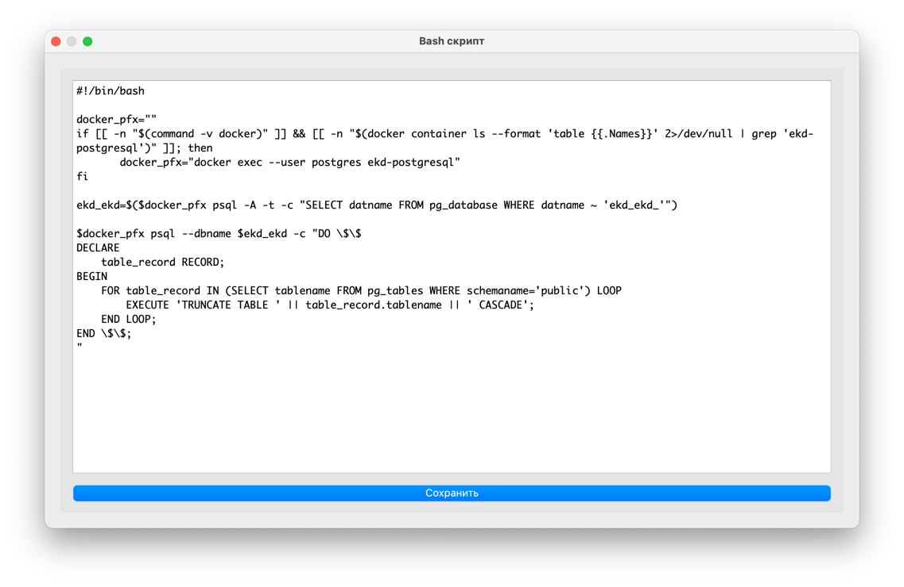

# Script-creator

An application to generate `bash` scripts from SQL scripts for execution on machines running `PostgreSQL`, 
whether inside or outside a `Docker` container.

## Why?

Because you need an easy-to-use and a polished solution for a mundane task.

Plus you're less likely to make a mistake, as all `bash` parts of the script have been thoroughly tested.

## Screenshots

## Installation

Download latest release from [Releases](https://github.com/gkeep/script-creator/releases/latest) page.

## Development

1. Clone the repo:
    `git clone https://github.com/gkeep/script-creator`
2. Create a `virtualenv`
    `python3 -m virtualenv venv`
3. Initialize the Python virtual environment
    `source venv/bin/activate` (command may differ depending on your OS and shell)
4. Install python requirements
    `pip install -r requirements.txt` (use `requirements_win.txt` on Windows)

Now you can build the application binary or run it from your IDE of choice.

Building the binary (Linux & Windows)
    `make build_linux` or `make build_windows`, depending on your OS
